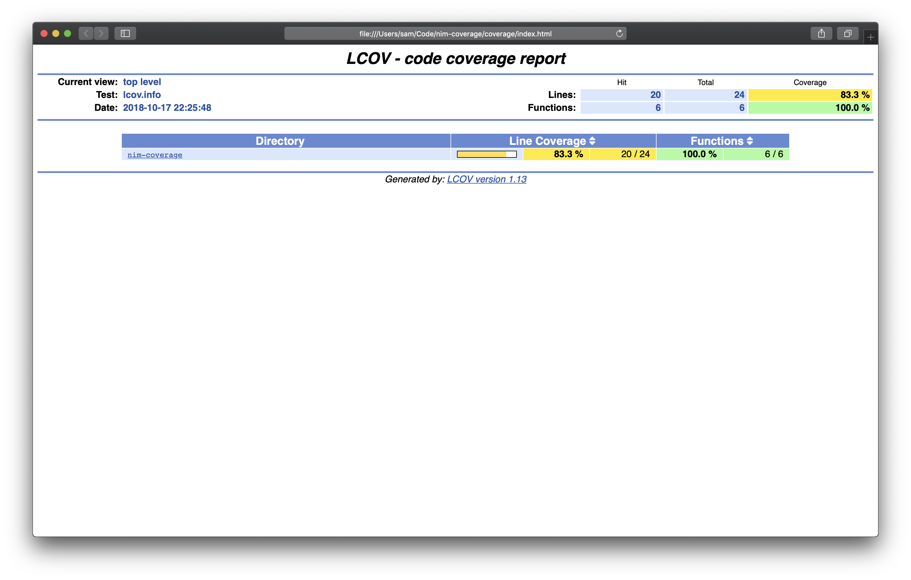

# Code coverage Nimble task

This repo is showcasing how to code coverage your Nim project using LCOV through a nimble task.
___

## Usage

Clone this repo and run:

`nimble coverage`

It will generate a `lcov.info`file on your project root folder and create a report under `coverage/`. 

To check your report, open the file `coverage/index.html`in your browser:

## How does it work?

This Nimble task will loop over the files in `tests/`, compile in coverage mode and run the tests automatically.

**If you don't have unit tests: tweak the task to make it work with your project.**

## VScode visualization

Install [Coverage Gutters - Visual Studio Marketplace](https://marketplace.visualstudio.com/items?itemName=ryanluker.vscode-coverage-gutters).

This nice plugin will map your coverage to your source code right into VScode:

## Tests

This task has only been tested under MacOSX. Feel free to open a pull request to share your experiments to code coverage Nim projects.

## TODO

- [ ] Support for subdirectories in tests/
- [ ] Coveralls.io integration

## Dependencies

[Linux Test Project - Coverage » lcov](http://ltp.sourceforge.net/coverage/lcov.php)