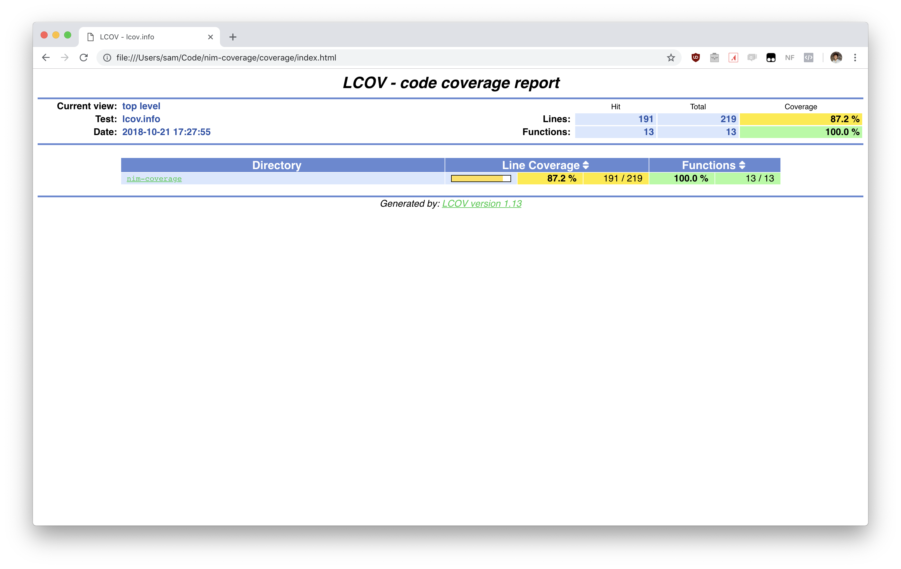
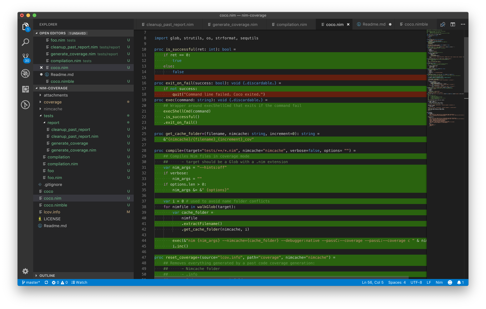

> Code coverage for Nim using LCOV.
___

## Features

* Line & Branch coverage support
* Forwards nim compiler options
* Works out-of-the box with Nim unittests
* API + CLI
* HTML report


## Installation & usage

Install using [Nimble](https://github.com/nim-lang/nimble):

```shell
nimble install coco
```

### CLI

Generate a code coverage report:

```shell
coco --target "tests/**/*.nim" --cov '!tests' --compiler="--hints:off" 
```

The flag `--target` tells Coco to run and compile nim files in the `tests/` directory (and subdirectories if any).

The flag `--cov` is helpful for extracting or removing data from the file `*.info`. Here we don't want code coverage for our tests, only for our main library `coco`.

The flag `--compiler` forwards its value directly to the Nim compiler.

**To get the full list of available flags, type in your shell `coco -h`**
___
By default, Coco will generate a `lcov.info` file on your project root folder and create a report under `coverage/`. 

To check your report, open the file `coverage/index.html`in your browser:



## VScode visualization

Install [Coverage Gutters](https://marketplace.visualstudio.com/items?itemName=ryanluker.vscode-coverage-gutters).

This nice plugin will map your coverage to your source code right into VScode:



### Library

import and use:

```nim
import coco

discard coverage(target = "tests/foo.nim", branch = true)

```

You can find the full documentation here: [API Coco](https://samuelroy.github.io/coco/)


## Tests

This task has only been tested under MacOSX. Feel free to open a pull request to share your experiments to code coverage Nim projects.

## TODO

- [x] Support for subdirectories in tests/
- [ ] Coveralls.io integration

## Dependencies

[Linux Test Project - Coverage » lcov](http://ltp.sourceforge.net/coverage/lcov.php)
